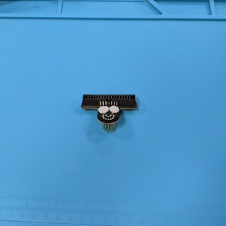
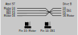
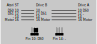

# Atari ST Floppy Adapter

This repository contains the KiCad project and Gerber files for an adapter that
converts the Atari ST external 14 pin floppy connector to a standard 34 pin IDC
box header. The 14 pin flopy connectors are out of production for a long time
and are extremely hard to get hold of and expensive nowadays. This adapter is a
cheap workaround.

This Floppy Adapter is designed to be used in combination with my
[DSUB-19 Adapter for the Atari DMA/Harddisk port](https://github.com/pdaehne/DSUB19-Adapter),
they fit nicely next to each other. I also tried not to hide other connectors,
but I only have an Atari 1040 STF to check that, so your mileage might vary.
Please check the situation on your Atari before ordering the PCBs!

## Acknowlegements

This project is based on the
[work of Justin Davis](https://hackaday.io/project/181628-atari-st-floppy-drive-emulator-adapters)
who shared the information about the correct pins for the adapter in the comment
section of his project page, on the
[work of the user "Atarian Computing" on the Exxos Forum](https://www.exxoshost.co.uk/forum/viewtopic.php?t=956&sid=13cd7669f4fdfc9c40bdac74b315d1e2) who did the tedious task of measuring the
locations of the pins in the connector, and on the
[work of Michael Rath](https://forum.classic-computing.de/forum/index.php?thread/30190-sammelbestellung-atari-st-disketten-adapter/)
who had the idea with the configurable signals on pins 10 and 14 of the box
header. Michael sells his adapters on Ebay, so you might consider buying one
from him and supporting his work.

## Ordering the PCB

The subdirectory "gerber-files" contains a Zip file you can use to order the PCB
from PCB manufacturers like PCBWay or JLCPCB. Simply upload the Zip on their web
page. I recommend to use the standard PCB thickness of 1.6mm and HASL finishing.

## Building the Adapter

### Bill of Materials

* __14x Solder Pins__.

  These pins are used to recreate the 14 pin floppy plug. They are Mill-Max
  4123-0-00-15-00-00-08-0. You can get these e.g. from
  [DigiKey](https://www.digikey.com/en/products/detail/mill-max-manufacturing-corp/4123-0-00-15-00-00-08-0/10063633)
  or
  [Mouser](https://www.mouser.com/ProductDetail/Mill-Max/4123-0-00-15-00-00-08-0?qs=h6V4JsTaLXe%252BQYANhNcpOA%3D%3D).

* __1x 2x17 Pin Straight Male Box Header 2.54mm pitch__.

  Used to connect the flat ribbon cable to the adapter.

* __2x 1x3 Pin Headers 2.54mm pitch (optional)__.

  Used to select the signals that go to pins 10 and 14 of the box header. These
  are only needed when you want to be able to configure your adapter for
  different setups, otherwise you can simply bridge the connections on the PCB
  by soldering in a piece of wire.

* __2x Jumpers 2.54mm pitch (optional)__.

  Used to select the signals that go to pins 10 and 14 of the box header.

* __3x Self Adhesive Silicone Rubber Pads 5x2mm (optional)__.

  These are used to prevent the pins on the back of the adapter from scratching
  the case of your Atari ST. They must be quite small, 5mm diameter and a height
  of 2mm. You might be able to get these locally in a stationery shop or a
  hardware store, but I got mine from AliExpress.

### Soldering the Pins

Start with soldering the 14 pins/nails to the PCB. It is crucial that you solder
these pins straight to the PCB, otherwise they will not fit into the socket. I
recommend to use the actual floppy socket on your Atari ST or on an old external
floppy drive as a soldering aid. Stick the pins into the socket, and attach the
PCB to the pins, e.g. by using an adhesive like
[Blu Tack](https://en.wikipedia.org/wiki/Blu_Tack). Solder the pins to the PCB,
but be careful not to destroy your soldering aid by applying excessive heat or
by dropping solder.

I myself did only have the socket on my Atari ST, and I did not succeed to
solder the pins without removing the mainboard from the case - whenever I tried
to put the PCB on the pins I pushed the pins too far into the socket. Removing
the mainboard is quite a tedious task, but doing it this way is much easier and
prevents you from damaging your precious Atari ST case. But nevertheless, the
whole soldering process is quite finicky.

### Soldering the Box Header

Solder the box header to the PCB. Mind the orientation, the notch of the header
must face in the direction marked on the silk screen (downwards in the image
below in direction to the pins).

Before soldering the box header, there is an optional step that I recommend to
do. When you plan to use an original floppy cable from an IBM-compatible PC, you
might realize that these cables are frequently keyed with a missing pin. On the
box header it is the third pin from the left in the bottom row (see the images
below). On the floppy side, it is actually the second pin that is missing, so
you cannot install the cable in the wrong direction, but do not get confused -
on the adapter side, you have to remove the third pin! Removing the pin is
actually quite easy - simply use a pair of pliers to pull the pin out of the
socket. Again, please do triple-check that you remove the third pin from the
left on the row facing the notch (see the images below) - when you get this
wrong, you might get a non-working adapter!

Even when the cable that you plan to use to connect your floppy to the adapter
does not have this keying, I nevertheless recommend that you remove the pin,
because it is easy to do, and doing it after soldering the box header to the PCB
is nearly impossible.

To solder the box header to the PCB, I again recommend to use an adhesive like
Blu Tack to stick it to the PCB. I also recommend to stick the floppy cable into
the socket, because it happens easily that the plastic of the socket melts and
the pins start to move when you apply to much heat while soldering, and this
might ruin the whole adapter!

### Soldering the Pin Headers

Next step is to solder the two pin headers used to configure the signals on pins
10 and 14 of the box header. How to configure the adapter is explained more in
detail in the section [Using the Adapter](#using-the-adapter) below. Of course
using pin headers and jumpers is optional - when you do not need support for
multiple configurations, you can also simply solder pieces of wire to the PCB
to generate a fixed configuration. When soldering, make sure that you solder the
pin headers straight onto the PCB.

### Attaching the Silicone Rubber Pads

The final step is to stick the silicone rubber pads to the adapter. This step
of course is completly optional, but when you attach the adapter to your Atari
ST, the pins on the back get in contact with its case and might scratch it.
Simply sticking three rubber pads to the adapter as shown in the image below
will prevent that from happening.

## Using the Adapter

Carefully push the adapter into the 14 pin floppy socket. Use the cable to
connect your external floppies to the adapter.

Before you can use the adapter, you have to configure it correctly for your
specific setup. To understand this process, we have to dive into the theory of
how floppies and floppy cables actually work. This is a simplified overview just
for configuring the adapter, and I will leave out many details which are not
important for that task.

On Atari ST machines as well as IBM-compatible PCs, you can attach up to two
floppy drives, called drive "A" and drive "B". On the floppy connectors and the
floppy cables, there are two signal lines which tell the floppies to which one
of both the computer is currently talking to. These signals are called "Drive
Select 0" (short "DS0") for drive A, and "Drive Select 1" (short "DS1") for
drive B.

On the Atari ST, you have to configure the drives whether they respond to DS0 or
DS1. There are little jumpers on the floppy drives that you have to set
accordingly.

On PCs, a much simpler solution is used. PC floppy drives are generally
configured to respond to DS1, and it is usually not possible to change this
configration without using a soldering iron. There is a twist on PC floppy
cables that exchanges the signals DS0 and DS1 (see image below). When you
connect a PC floppy to a connector after the twist, it becomes drive A. When you
connect it to a connector before the twist, it becomes drive B.

These differences between Atari ST and PC floppy drives and cables lead to a
lot of confusion when connecting floppies or floppy emulators like Gotek drives.
This is complicated even more by the fact that there are Atari STs without
internal drives (e.g. 520 ST) and with internal drives (e.g. 1040 STF). When you
have an Atari ST with an internal drive, you can only connect one external
drive. The DS0 signal line on the external connector internally is actually
connected to DS1, so DS0 and DS1 are the same signal. To connect two external
drives to an Atari 1040 STF, you have to disconnect the internal drive and you
have to modify the mainboard to provide signal DS0 to the external connector.

So, after all that background information, let us get back to the configuration
of the adapter.

There are two pin headers with 3 pins, respectively.

The left one controls the signal on pin 10 of the box header. When you connect
the left and the center pin with a jumper, the "Motor" signal is connected to
pin 10. When you connect the center and the right pin, the "DS0" signal is
connected to pin 10. Whenever you are connecting a floppy using a _twisted_
cable, you have to use the "Motor" signal, otherwise you have to use the "DS0"
signal.

The right pin header controls the signal on pin 14 of the box header. When you
connect the left and the center pin with a jumper, the "DS1" signal is connected
to pin 14. When you connect the center and the right pin, the "DS0" signal is
connected to pin 14. Whenever you are connecting a floppy with an _untwisted_
cable, you can ignore this pin header, i.e. you do not have to set a jumper, it
does not matter. Otherwise, when using a _twisted_ cable, you control which
drive select signal gets sent to the floppy at the connector behind the twist.
When the floppy is configured as "DS0", you have to send the "DS0" signal, and
when the floppy is configured as "DS1", you have to send the "DS1" signal.

Let us have a look at some concrete scenarios. We will start with the simple
case, an Atari ST with an integrated floppy (A) and one single external floppy
(B):

* When you use a straight, untwisted cable:

  The external floppy (B) can be configured either for DS0 or DS1. Pin 10 must
  be configured as DS0, so on the left pin header, you have to connect the
  center and the right pin with a jumper. Pin 14 is not used, so leave the right
  pin header without a jumper.

  

* When you use a twisted cable:

  The external floppy (B) must be configured for DS1. Pin 10 must be configured
  as Motor, so on the left pin header, you have to connect the left and the
  center pin with a jumper. Pin 14 must be configured as DS1, so on the right
  pin header, you have to connect the left and the center pin with a jumper.

  

Now, let us have a look at an Atari ST without an integrated floppy and two
external floppies (when you only attach a single external floppy, use the same
configuration, and simply leave drive B away):

* When you use a straight, untwisted cable:

  One floppy (A) must be configured for DS0, and the other floppy (B) must be
  configured for DS1. Pin 10 must be configured as DS0, so on the left pin
  header, you have to connect the center and the right pin with a jumper. Pin 14
  is not used, so leave the right pin header without a jumper.

  

* When you use a twisted cable:

  Both floppies must be configured for DS1. The floppy after the twist becomes
  drive A, and the floppy before the twist becomes drive B. Pin 10 must be
  configured as Motor, so on the left pin header, you have to connect the left
  and the center pin with a jumper. Pin 14 must be configured as DS0, so on
  the right pin header, you have to connect the center and the right pin with a
  jumper.

  

> [!NOTE]
> When you use this adapter to connect actual floppy drives instead of Gotek
> emulators, you might notice that the motors of both floppy drives start to
> spin when you try to access any of the drives. This is actually correct and
> the expected behaviour!

> [!NOTE]
> Also notice that the Atari ST only boots from drive A. When your Atari ST has
> a built-in floppy, that floppy is drive A. You won't be able to boot from the
> external drive, unless you do a hardware mod to the machine.

## License

Atari ST Floppy Adapter (c) by Patrick Dähne

Atari ST Floppy Adapter is licensed under a
Creative Commons Attribution-NonCommercial-ShareAlike 4.0 International License.

You should have received a copy of the license along with this
work. If not, see <https://creativecommons.org/licenses/by-nc-sa/4.0/>.
